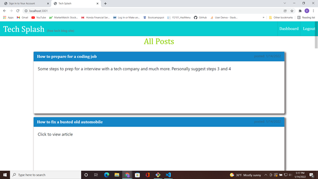
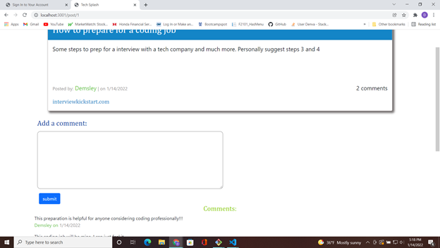
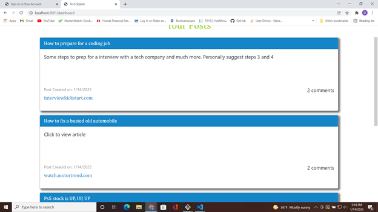
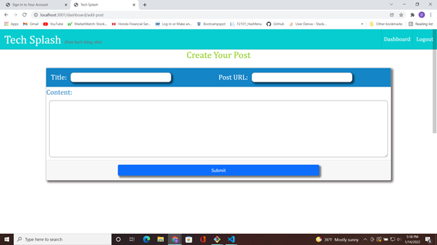

# Tech-splash 
  ## Description 

  Tech splash is a new tech inspired blog spot and forum. It was created using the handlebars express package through node, and all front-end and back-end coding done by one developer, ME. The code base structure follows the popular MVC paradigm to created information to store in a database server, then display it in hte users browser view through routes that are created to acess the data. Just the first of many applications for this beginning full stack web developer.

  ## Table of Contents
  In here you will find links to each section of this projects readme
  - [Installation](#installation)
  - [Usage](#usage)
  - [License](#license)
  - [Screnshots/Links](#screenshots/links)
  - [Tests](#tests)
  - [Questions](#questions)

  ## *Installation*

  This app is hosted live on a website so no need to install. The project files can be found on the repo linked here [Project Repo](https://github.com/Demsley1/Tech-Splash )

  ## Usage 

  When you go the webpage for this app you will see any posts other users may have added to the site already. If you want to get a look at the content, and to access a user link to a site, click on the post. If you would like to contribute, or comment on the site, you will have to sign-in if you already have an account, or sign-up by clicking on the matching navigation links at the top of the page. When logged in you can navigate to the dashboard and create a post, or redirect back to the homepage by clicking the site logo, at hte top of page , and adding a comment by clicking on a users post.

  ## Screenshots/Links

  
  
  
  

  - Live Page: [Tech-Splash](https://safe-caverns-00312.herokuapp.com/)
 
  ## *License*

  Copyright 2021 &copy; Denva

      Permission is hereby granted, free of charge, to any person obtaining a 
      copy of this software and associated documentation files (the "Software"), 
      to deal in the Software without restriction, including without limitation 
      the rights to use, copy, modify, merge, publish, distribute, sublicense, 
      and/or sell copies of the Software, and to permit persons to whom the Software 
      is furnished to do so, subject to the following conditions:
          
      The above copyright notice and this permission notice shall be included in all copies or substantial portions of the Software.
          
      THE SOFTWARE IS PROVIDED "AS IS", WITHOUT WARRANTY OF ANY KIND, EXPRESS OR IMPLIED, INCLUDING BUT NOT LIMITED TO THE WARRANTIES OF MERCHANTABILITY, FITNESS FOR A PARTICULAR 
      PURPOSE AND NONINFRINGEMENT. IN NO EVENT SHALL THE AUTHORS OR COPYRIGHT HOLDERS BE LIABLE FOR ANY CLAIM, DAMAGES OR OTHER LIABILITY, WHETHER IN AN ACTION OF CONTRACT, TORT OR OTHERWISE, 
      ARISING FROM, OUT OF OR IN CONNECTION WITH THE SOFTWARE OR THE USE OR OTHER DEALINGS IN THE SOFTWARE.
      

  ## Tests

  Test this app by using it, creating an account, and interacting on the site.

  ## Questions 

  - My GitHub username: Demsley1
  - Link to my GitHub page and repositories: [Github Link](https://github.com/Demsley1)
  _Link to my main work email if anyone should ever choose to contact me regarding work, or with helpful suggestions on how to improve this project and 
  also fix or update any major issues with project_
  - For All inquires email me at: emsley3684@gmail.com
